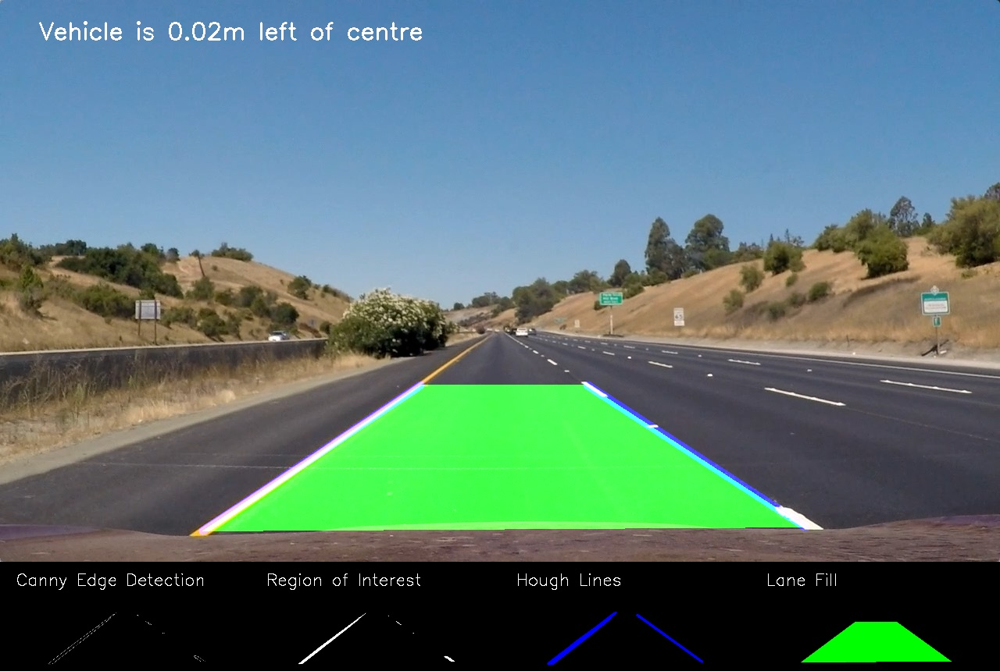
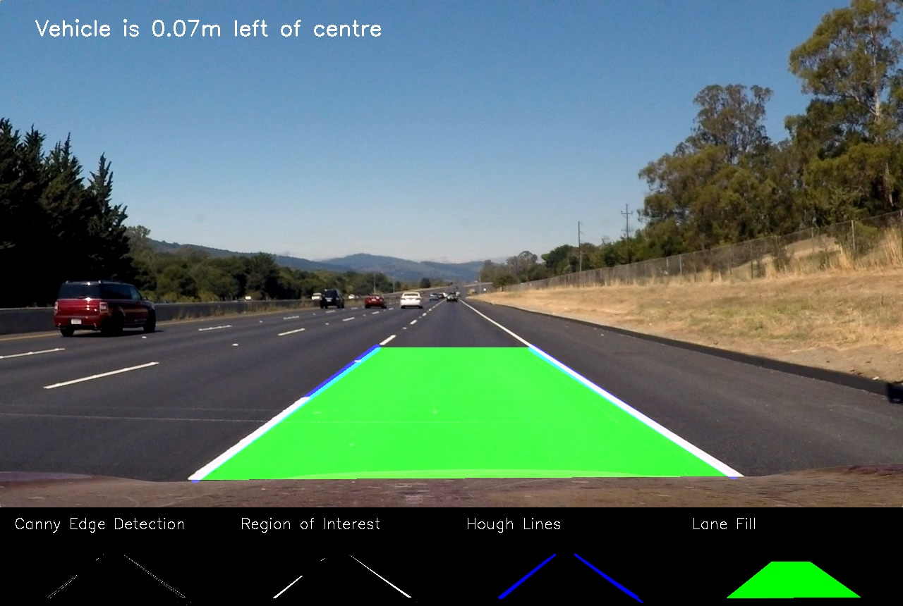
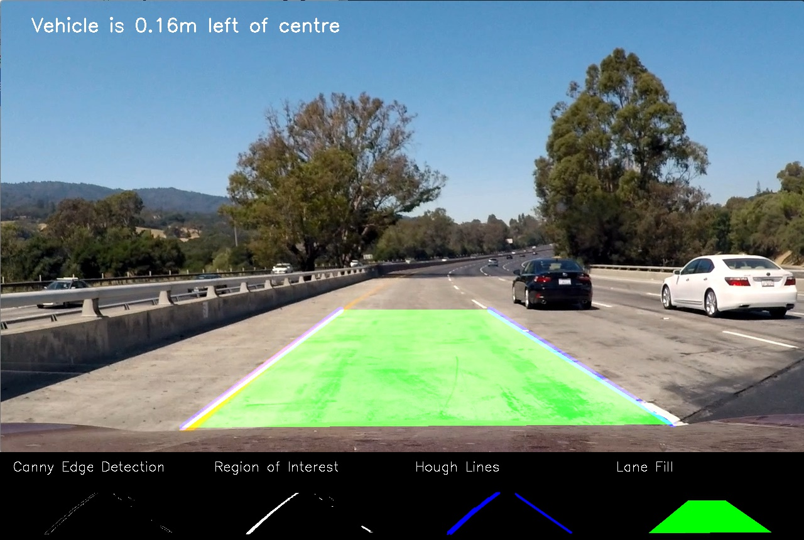
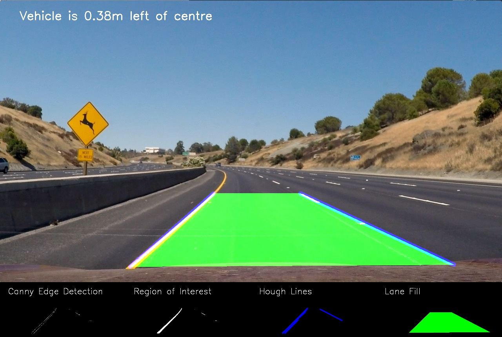
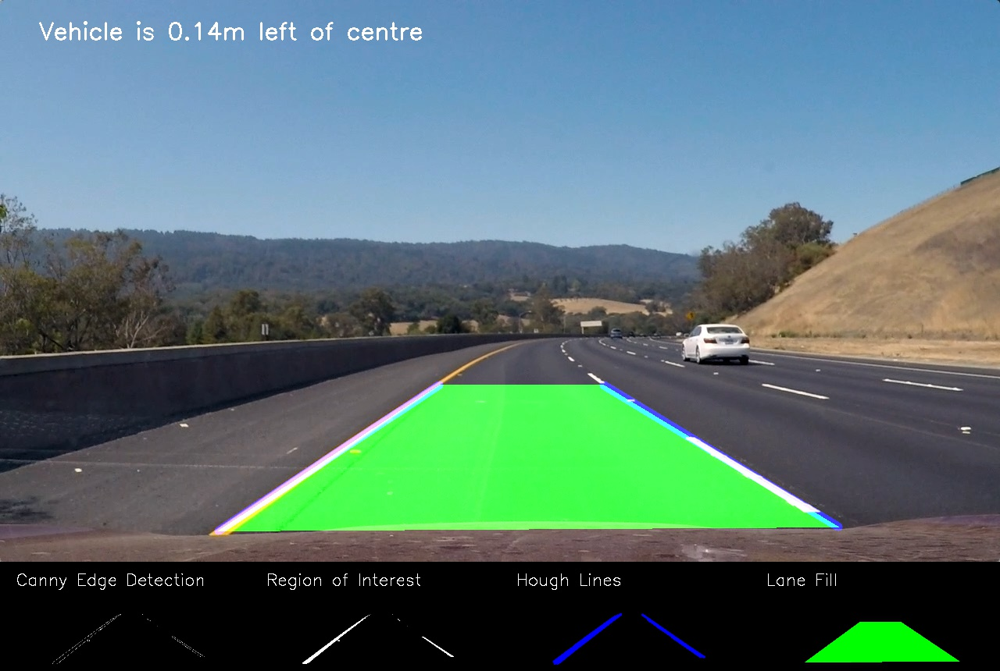
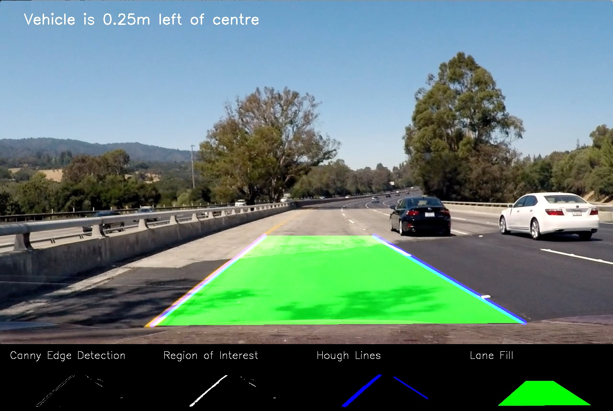
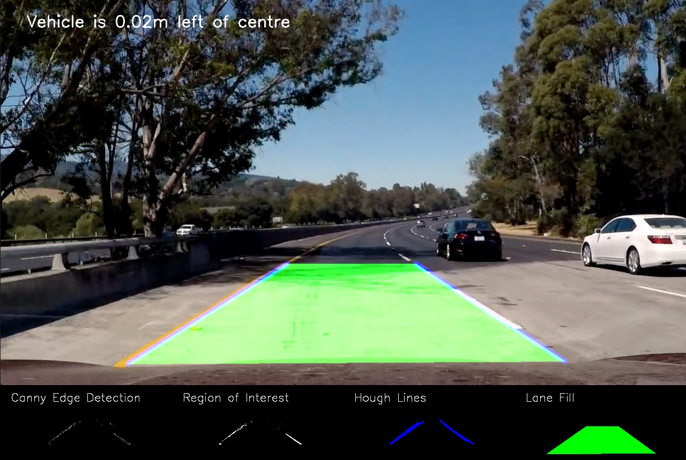
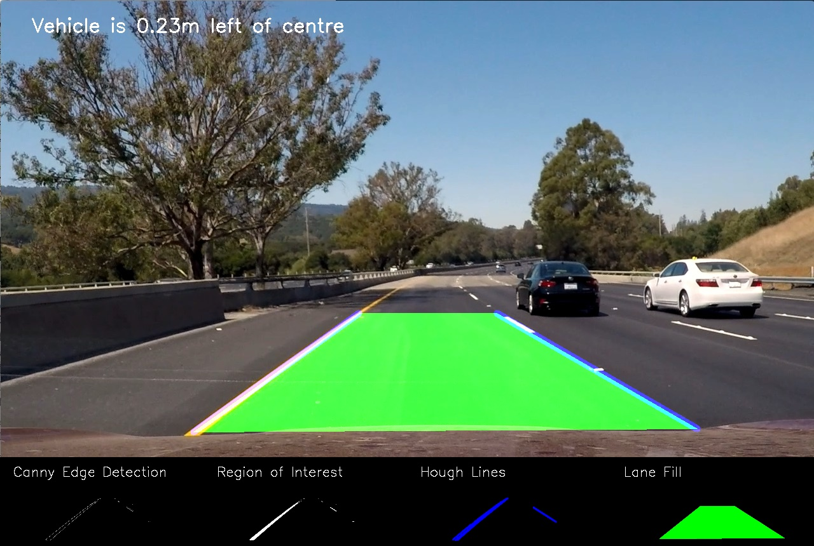

# self-driving-car-CompVision
You can easily run our project in jupyter-notebook and we also state any packages to install to avoid any errors
The following commands needed to install the packages that we used
1) For cv2 library you can use the following commands:
**pip install opencv-python**
if you face any probem you can upgrade the python version to the latest one
**pip install --upgrade opencv-contrib-python**
2) For numpy library you can use the following command:
 **pip install numpy**
3) For matplotlib library you can use the following command:
**pip install matplotlib**
4) For glob library you can use the following command:
**pip install glob**

## Table of Contents

- [Project Description](#Project-Description)
- [The-First-Phase](#The-First-Phase)
- [Implementation-Phase1 ](#Implementation_Phase1 )
- [The-Second-Phase](#The-Second-Phase)

## Project-Description
In this project we are going to create a simple perception stack for self-driving cars (SDCs.) Although a typical perception stack for a self-driving car may contain different data sources from different sensors (ex.: cameras, lidar, radar, etc…), we’re only going to be focusing on video streams from cameras for simplicity. We’re mainly going to be analyzing the road ahead, detecting the lane lines, detecting other cars/agents on the road, and estimating some useful information that may help other SDCs stacks. The project is split into two phases. 
### The-First-Phase 
The expected output is as follows:
1) Your pipeline should be able to detect the lanes, highlight them using a fixed color, and pain the area between them in any color you like (it’s painted green in the image above.)
2) You’re required to be able to roughly estimate the vehicle position away from the center of the lane.
 #### Implementation-Phase1 
1) We used hough transform to detect the lines that we will draw on the lanes
2) We used the canny function to detect all the edges in the test videos and imgs
3) We could find the lines when we know the equation of line (the slope and interecpt)
4) We could find the region of interest and fill it by knowing the the equations of the lines to know the coordinates of the lines
5) We extracted the yellow color and threshold the while color with the original image or video to detect the yellow and white lanes
6) To reduce the noise we applied gaussianBlur after convert the every frame to grayscale 
7) We called the reigon of interest function and make AND operation with the blur video to detect the region 
8) We also handle the blanking of the lines 
9) We also Determined the center of the lane by mapping of the actual distance in meters to pixel by knowing the center of the lane and the car
10) There is also a Debugging mode also by put with the output videos and test imgs (the hough result ,Canny result,Region of interest and The filling between the lanes)

#### Sample Test Output Images:
   
   
   
   

### The-Second-Phase 
The expected output is as follows:
Locate and identify the cars on the road

